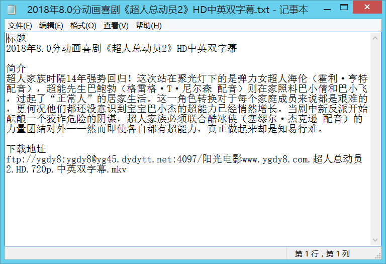

### quick start

```
npm run start
```
抓取的电影图片以及简介信息等放在data目录下，每次执行`npm run start`都会清空上一次抓取的数据，再重新爬取




### fs.createWriteStream
fs.createWriteStream 似乎不会自己创建不存在的文件夹，所以在使用之前需要注意，保存文件的文件夹一定要提前创建。
```
const path = '/xxxxxx/data/';

if (!fs.existsSync(path)) {
 fs.mkdirSync(path);
}
```
创建完文件夹，我们就可以进行文件添加操作了
```
const wstream = fs.createWriteStream(filePath);
wstream.write('XXX');
```

### request模块
```
const request = require('request')

var url = 'https://s.weibo.com/top/summary?cate=realtimehot'

// 发送Get请求
// 第一个参数:请求的完整URL,包括参数
// 第二个参数:请求结果回调函数,会传入3个参数,第一个错误,第二个响应对象,第三个请求数据

request(url,function(error,response,data){
    console.log('error:', error);
    console.log('statusCode:', response && response.statusCode);
    console.log('body:', data);
});
```

### iconv-lite
使用iconv-lite解决node当中不支持GBK编码的问题
```
const Iconv = require('iconv-lite');
Iconv.decode(data, 'gb2312')
```

### html解析
[cheerio](https://github.com/cheeriojs/cheerio)是nodejs的抓取页面模块，为服务器特别定制的，快速、灵活、实施的JQuery核心实现。适合各种Web爬虫程序。
这样就能使用类似JQuery中的$对html信息进行操作

```
request({url: `https://www.dytt8.net`, encoding: null}, function (error, response, body) {
    let data = Iconv.decode(body, 'gb2312').toString()
    var $ = cheerio.load(data)
    var element = $('.co_content2 ul a')
    ...
}
```