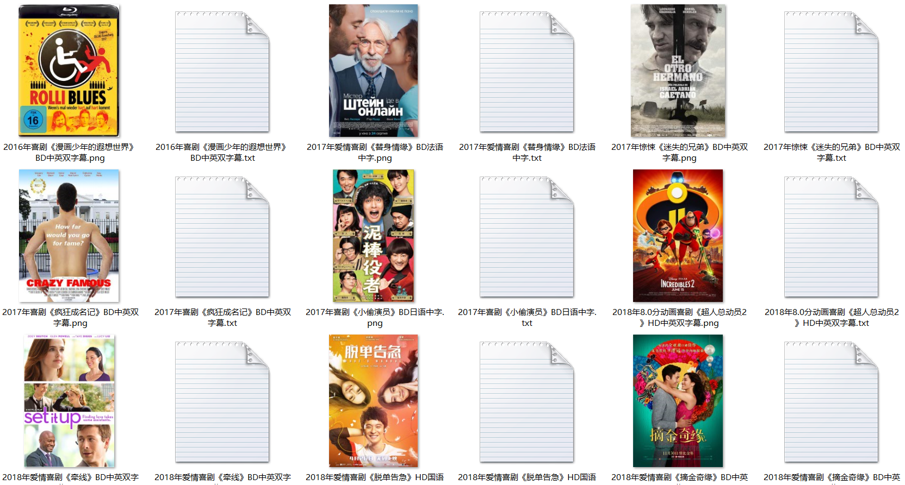

### quick start

```
npm run start
```
抓取的电影图片以及简介信息等放在data目录下，每次执行`npm run start`都会清空上一次抓取的数据，再重新爬取




### fs.createWriteStream
fs.createWriteStream 似乎不会自己创建不存在的文件夹，所以在使用之前需要注意，保存文件的文件夹一定要提前创建。
```
const path = '/xxxxxx/data/';

if (!fs.existsSync(path)) {
 fs.mkdirSync(path);
}
```
创建完文件夹，我们就可以进行文件添加操作了
```
const wstream = fs.createWriteStream(filePath);
wstream.write('XXX');
```

### iconv-lite
使用iconv-lite解决node当中不支持GBK编码的问题
```
const Iconv = require('iconv-lite');
Iconv.decode(data, 'gb2312')
```